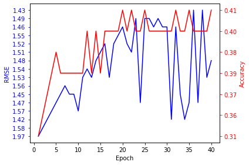

# amzbinimg
Capstone project based on Amazon Bin Image Dataset

## Results

### 1. 256 latent feature by autoencoder with 3 Dense layer

| Accuracy(%) | RMSE(Root Mean Square Error)|
|----------------------|--------|
| 40.26 | 1.45 |

### 2. github.com/silverbottlep/abid_challenge
Resnet 34 layer architecture and trained from the scratch by Image classification

| Accuracy(%) | RMSE(Root Mean Square Error)|
|----------------------|--------|
| 55.67 | 0.930 |

### 3. github.com/dandresky/inventory-classifier
VGG16 network application with fined tuning by Image classification

| Accuracy(%) | RMSE(Root Mean Square Error)|
|----------------------|--------|
| 46.5 | 1.214 |

### 4 .Amazon Inventory Reconciliation Using AI
http://cs229.stanford.edu/proj2018/report/65.pdf

Resnet 34 Adam 

| Accuracy(%) | RMSE(Root Mean Square Error)|
|----------------------|--------|
| 56.2 | 0.90 |